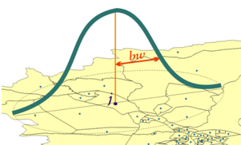

# TerraSegreg

A TerraView plugin to compute global and local indices of spatial segregation among population groups.

### Reference Article
F. F. Feitosa, G. Câmara, A. M. V. Monteiro, T. Koschitzki & M. P. S. Silva (2007) [Global and local spatial indices of urban segregation](https://www.tandfonline.com/doi/abs/10.1080/13658810600911903), International Journal of Geographical Information Science, 21:3, 299-323, DOI: 10.1080/13658810600911903.

### Install Instructions

1) Download and install [TerraView 4.1.0](http://www.dpi.inpe.br/terraview_previous_hidden/dow/terraView410.exe)
2) Download [TerraSegreg 1.0.0](http://www.dpi.inpe.br/terrasegreg/installer/TerraSegreg1.0.0.exe) installer
3) Run `TerraSegreg1.0.0.exe` and when prompted for the destination folder, select where the TerraView 4.1.0 is installed. (*e.g.*: `C:\Program Files (x86)\TerraView 4.1.0`)
4) Start `TerraView` :arrow_right: `TerraSegreg` will be accessible on "Plugins" menu.
